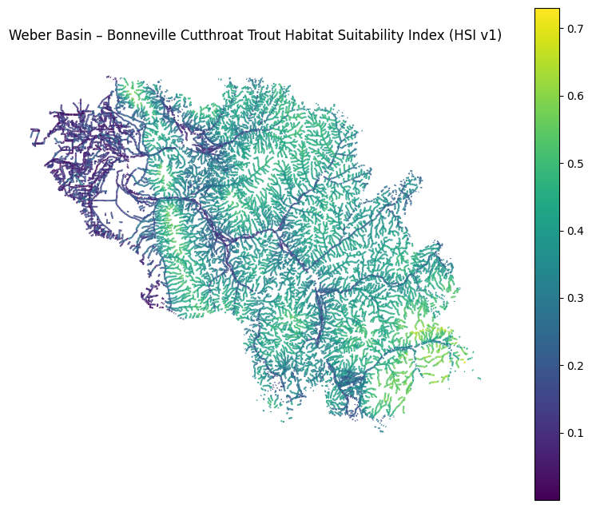
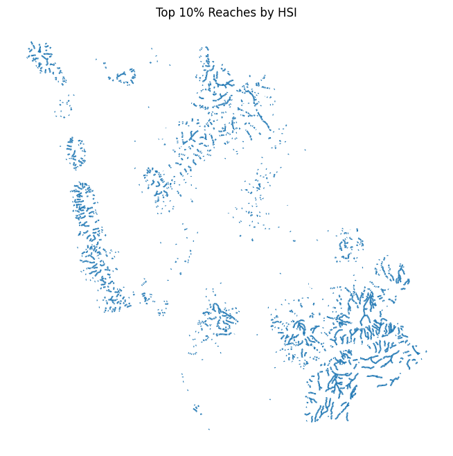

# Weber River Basin Cutthroat Trout Conservation GIS

This project develops a terrain-driven Habitat Suitability Index (HSI) model for Bonneville Cutthroat Trout in the Weber River Basin, Utah.

Using high-resolution elevation data and hydrologic analysis, stream reaches were segmented into 250m units and enriched with terrain-derived predictors to identify priority habitat corridors.

The goal of this project is to demonstrate a reproducible spatial analysis workflow applicable to watershed-scale conservation planning.

## Objectives
- Build reach-level habitat and connectivity metrics
- Identify priority stream segments for protection and restoration
- Demonstrate reproducible conservation GIS workflows using QGIS + Python

## Study Area
- Weber River Basin (HUC8: 16020102), Northern Utah
- Hydrologically connected stream network
- Modeled at 250-meter reach scale

## Data Sources
- USGS 3DEP 1/3 arc-second DEM (10m resolution)
- Stream network (NHD-derived)
- Basin boundary shapefile

## Methods
1. DEM Preprocessing
- Clipped DEM to upper and lower Weber Basins
- Reprojected the UTM (EPSG:26912)
- Hydrologically conditioned DEM
- Derived slope raster
- Generated flow direction and flow accumulation rasters

2. Stream Segmentation 
- Stream network splits into 250m reaches
- Unique reach_id assigned to each segment

3. Raster-to-Reach Aggregation
For each  250m reach, the following statistics were extracted:
- Mean slope
- Median slope
- Standard deviation
- IQR
- Mean elevation
- Elevation range
- Variability metrics
- Upstream Contributing Area (UCA) derived from flow accumulation raster
- UCA converted to area units
- UCA aggregated to reach level

4. Habitat Suitability Index (HSI)
An exploratory HSI was developed using normalized terrain predictors:
- Moderae slope preferred
- Mid-elevation preferred
- Moderate UCA preferred

Predictors were scaled and combined into a composite index rangeing from low to high suitability.

Top 10% of reaches were identified as priority habitat.

## Key Outputs
- slope_weber.tif
- flow_acc_weber.tif
- reaches_250m_id.gpkg
- reach_slope_stats.gpkg
- reach_elev_stats.gpkg
- reach_area_stats.gpkg
- Final reach dataset with HSI scores

## Results

The model identifies spatial clusters of high suitability habitat across the Weber Basin

The top 10% of reaches represent potential conservation or restoration priority zones.

## Tech Stack
- QGIS (hydrologic processing & spatial analysis)
- GRASS r.watershed
- GDAL raster tools
- Python (planned for modeling extension)
- GeoPackage for data management

## Future Improvements
This project is designed as a foundation for more advanced habitat modeling. Planned next steps include:

- Logistic regression modeling using presence/absence data
- Literature-informed weighting of predictors
- Incorporation of land cover and temperature proxies
- Transition to a fully reproducible Python-based spatial modeling workflow

## Why this project matters
Watershed-scale habitat modeling supports:

- Conservation prioritization
- Barrier removal planning
- Restoration targeting
- Climate resilience planning

This project demonstrates an end-to-end geospatial workflow for environmental decision support